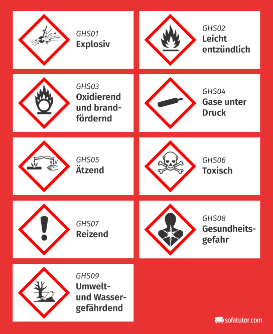

# Einleitung
## Unterschied Chemie / Physik

## Historisches:
### Altertum
- Metallgewinnung (Kupfer, Bronze)
- alkoholische Gärung
- Arzneien aus Naturstoffen
### Mittelalter
- Alchemie (Forschen nach der Goldherstellung)
- Schwarzpulver
### ab 18. / 19. Jhd
==Entstehung der "modernen" Chemie==

### BSP
Bsp: 
	Verbrennung -> Chemie
	 auflösen -> Physik
	 Gefrieren von Wasser -> Physik
	 Litionenakku (Beladung / Entladung) -> Chemie

Bedeutung Stoff... / Gegenstand:
> Wenn das äußerste Wichtiger ist als der Stoff dann wird es "Gegenstand" benannt.
> Wenn aber der Stoff wichtiger ist, wird es Stoff benannt.

(4.2-9 Stoffe-Zusammensetzung)

## Gefahren durch Chemikalien S10f.
> Gefahrenpiktogramme (s.11)

## Giftigkeit von Stoffen
### Aufnahmeweg von Giften
- Haut (dermal)
- Verschlucken (/Magen, Darm) (Oral)
- Atemwege (Inhalativ)
### Beurteilung von Giften
- LD50 (Lethale Dosis): Lethale Dosis pro kg Lebengewicht bei der 50% tötlich endet.

> zB: LD50 mouse: 400 mg/kg

## Sicherheitsdatenblatt
>Info:
zB Aceton

Sicherheitsdatenblätter:
- SDB
- MSDS (engl.)